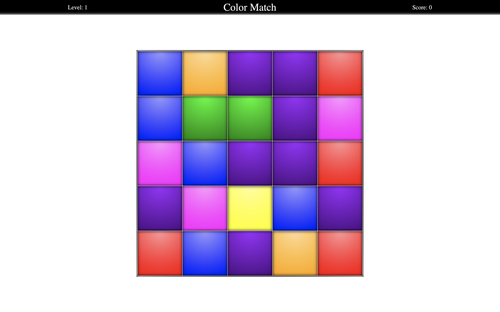

# COLOR-MATCH
A simple grid based game

	

## How to Play
Click any square that is touching one or more squares of the same color. All connecting squares of the same color will be destroyed. The goal is to get as high a score as possible untile there are no more possible moves.

## Technologies
* Typescript
* React
* SCSS
* React Context API
* Matrix-Map 